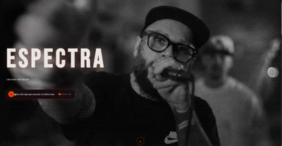

# ✨ Espectra

  

Espectra es una web conceptual centrada en crear una experiencia visual moderna, combinando diseño, animación y arquitectura frontend escalable.

El proyecto nace como exploración de cómo construir interfaces que no solo funcionen, sino que transmitan identidad y coherencia visual.

🌐 Demo: https://espectra-web.vercel.app/

---

## 🧩 Product vision

Espectra plantea una landing donde la experiencia visual es el eje principal:
estructura clara, ritmo entre secciones y micro-interacciones que acompañan la narrativa.

No es solo una web, es un ejercicio de construcción de producto frontend.

---

## ✨ Features

- Arquitectura basada en componentes reutilizables
- Diseño responsive real (desktop → mobile)
- Sistema visual consistente entre secciones
- Animaciones con Framer Motion
- Formulario funcional sin backend (EmailJS)
- Estructura preparada para escalar

---

## 🏗️ Tech Stack

**Frontend**
- React
- TypeScript
- Vite

**UI / Styling**
- Tailwind CSS

**UX / Motion**
- Framer Motion

**Integrations**
- EmailJS

---

## 🧠 Engineering focus

Este proyecto se centró especialmente en:

- Escalabilidad de componentes
- Separación de responsabilidades
- Organización de estilos
- Performance percibida (motion + layout)
- Pensar UI como producto

---

## 📸 Preview

git clone https://github.com/PatriciaAlEs/espectra-web
cd spectra-landing
npm install
npm run dev

👩‍💻 Author

Patricia Álvarez
Frontend Developer
